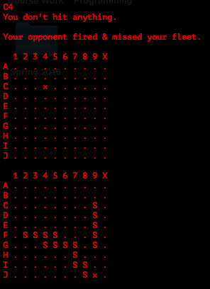
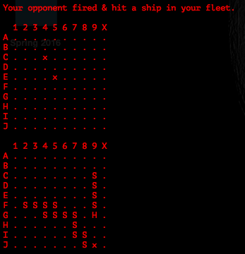
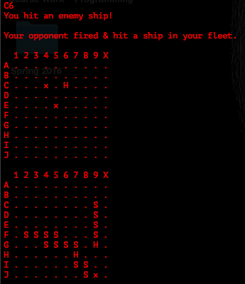
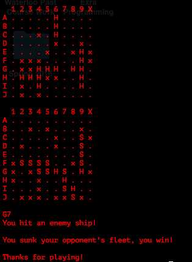

<h2> Battleships - C++ Implementation of the Classic Board Game </h2>

<h3> Playing The Game </h3>

Battleships is a two player game that involves trying to sink your opponents fleet. A large component of the game is the 
luck of choosing a territory where an opponents ship has been placed. For an in-depth explanation of how the game works, see
<a href="http://www.hasbro.com/common/instruct/Battleship.PDF"> here</a>.

<h3> Interface </h3>

This implementation uses the command line for input. The executable takes in one <i>optional</i> argument, a seed for the
computer to choose its attack coordinates from. Once the game has begun, you can, at any time, type 'Q' to end the game on the
spot. Otherwise, you input commands for the territory you want to attack. For example, the top left-most territory is space A1,
so giving input 'A1' attack thats space on the opponents grid.

The computer moves after the player, and the game continues until the player or the computer wins.

<h3> Pictures & Examples </h3>

<h4>Game initialization</h4>

<h4>First Shot</h4>

<h4>Enemy Hits Player</h4>

<h4>Player Hits Enemy</h4>

<h4>Player Wins Game</h4>

<h3> For Class Model, See UML.png </h3>
